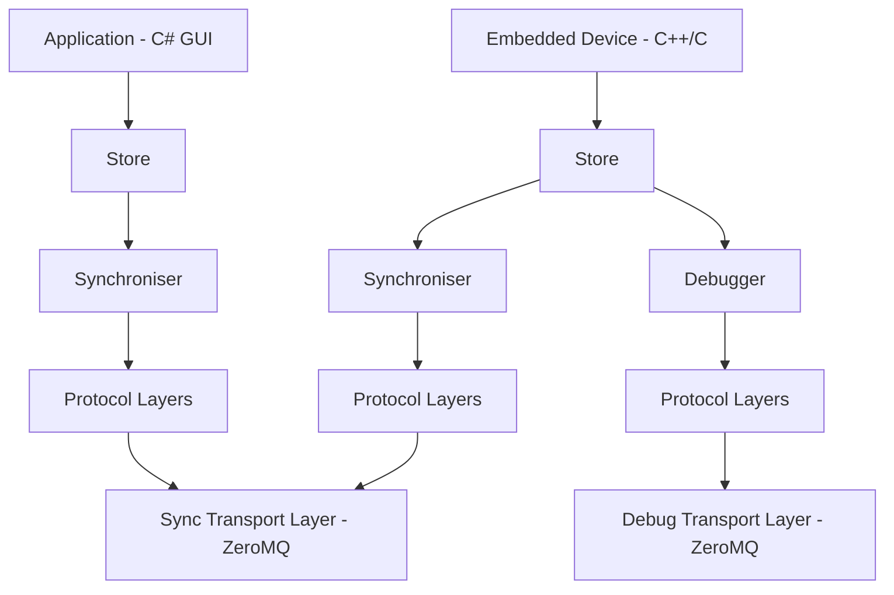

# LibStored.Net
[](https://github.com/DEMCON/libstored.net/actions/workflows/dotnet.yml)
[](https://www.nuget.org/packages/LibStored.Net)
[](https://www.nuget.org/packages/LibStored.Net)

A 100% native C# implementation of the [libstored](https://github.com/DEMCON/libstored) library, which is a library for storing and retrieving data in a structured way, using a store definition file. The library provides a set of layers to build applications that can communicate with a Debugger or Synchroniser.

Based on [libstored](https://demcon.github.io/libstored) by Jochem Rutgers, [GitHub](https://github.com/DEMCON/libstored).

## Scope

The goal of this library is to provide native C# implementation of a part the libstored library, such that it can be used in C# applications without the need for a C++/CLI wrapper. The library provides a set of layers to build applications that can communicate with a Debugger or Synchroniser.

This C# implementation target C# GUI's that synchronize data with an embedded device. The embedded device can be a microcontroller, FPGA, or any other device that can communicate using the libstored protocol. The C# implementation is not intended to be a full replacement of the C++ implementation, but rather a subset of the features that are needed for C# GUI applications.

On the embedded side, the libstored Debugger is a great way to debug a live running embedded application from a remote system. In C# and the tooling and editor for it, there are other option for debugging, so there is no need to a full featured libstored Debugger.



## Features

### Application layers
- Debugger
  - All commands are supported except:
   - ReadMem ('R') / WriteMem ('W')
   - Flush ('f'), not needed since compression is not implemented.
- Synchronizer

### Protocol layers
- AsciiEscapeLayer
- TerminalLayer
- Crc8Layer (0xA6)
- Crc16Layer (0xBAAD)
- Crc32Layer (reversed 0x04c11db7)
- LoggingLayer using ILogger
- LoopbackLayer
- BufferLayer
- SegmentationLayer
- ArqLayer
- IdleCheckLayer

### Transport layers
- ZeroMQ using [NetMQ](https://netmq.readthedocs.io/)
  - DebugZeroMQLayer: to connect to the Debugger
  - SyncZeroMQLayer: to connect to the Synchronizer (connection)

### Store generation

This project uses a C# Source Generator to create strongly-typed store classes from store metadata YAML (.yml) files at compile time. 
This YAML file is automatically created when generating code for a store (.st) using [libstored](https://demcon.github.io/libstored) (from version v2.1.0).

How to use the Source Generator:
- Add the store metadata files (*.yml) to your project as AdditionalFiles so the source generator can read them during compilation.
- Reference the LibStored.Net either by adding the NuGet package. This package include the Source Generator.
- The generator emits C# store classes implementing the `Store` base class. Use them directly from your code after a build.

Example csproj snippet:
```xml
<ItemGroup>
    <AdditionalFiles Include="TestStore.yml" />
</ItemGroup>
```
For more information about the Source Generator see the [README.md](src/LibStored.Net.Generator/README.md).

### Thread safety
In [libstored](https://demcon.github.io/libstored) you are only allowed to access a store from a single thread. The store may only be accessed from a single thread (the thread that runs the NetMQPoller)
This C# implementation adds locking to all read and writes to the store buffer.
The C# store is therefore safe to use from any thread, at the cost of some performance.
Another option would be to create a store per thread, and synchronize them using the `Synchronizer` and communicating within the same process.

### Missing / unsupported / future features?
- Only little endian stores are supported.
- Functions are not supported.
- Heatshrink compression is not supported.

#### Missing layers
- PolledLayer(s)
- FileLayer
- NamedPipeLayer
- StdioLayer (use `libstored.Stdio2Zmq` as alternative for local debugging, not production ready)
- SerialLayer (use `libstored.Serial2Zmq` as alternative for local debugging, not production ready)

#### Unsupported features

Types: `Pointer`, `Pointer32` and `Pointer64` are not supported, as they are not needed in C# applications. The `ptr32` and `ptr64` types are used to store pointers to other objects in the store, which is not needed in C# applications as the objects are stored in managed memory. These types will be mapped to unsigned integers (`uint` and `ulong`) in the C# implementation.

## Example

```csharp
using LibStored.Net;
using LibStored.Net.Debugging;
using LibStored.Net.Protocol;
using LibStored.Net.ZeroMQ;
using NetMQ;
using NetMQ.Sockets;

// Make sure this ExampleStore is created by the source generator from ExampleStore.yml.
ExampleStore store = new();

// Attach the store to the debugger
Debugger debugger = new();
debugger.Map(store);

// Expose the Debugger using ZeroMQ
using ResponseSocket socket = new("@tcp://localhost:5555");
DebugZeroMQLayer debugLayer = new(socket);
debugLayer.Wrap(debugger);

// Run the message loop to receive requests from the Debugger
using (NetMQPoller poller = [socket])
{
    socket.ReceiveReady += (_, _) =>
    {
        debugLayer.ReceiveAll();
    };

    // Start the event loop
    poller.Run();
}
```

Connect to the debugger using the [libstored.gui](https://github.com/DEMCON/libstored/tree/master/python) on the port that is exposed.

```bash
python -m libstored.gui -p 5555
```

## Compatibility

Tested with libstored versions:
- [v2.1.0](https://github.com/DEMCON/libstored/releases/tag/v2.1.0)
- [v2.0.0](https://github.com/DEMCON/libstored/releases/tag/v2.0.0)
- [v1.8.0](https://github.com/DEMCON/libstored/releases/tag/v1.8.0)
- [v1.7.1](https://github.com/DEMCON/libstored/releases/tag/v1.7.1) (see note below)

See [libstored changelog](https://demcon.github.io/libstored/doc/changelog.html) for the changes. There do not seem to be breaking changes from <v1.7.1 to v1.7.1 for this C# implementation.

Only the latest major version of libstored will be supported.

### libstored >v1.7.1
The ZeroMQ socket type changed from `PAIR` to `DEALER` for the SyncZeroMQLayer. Make sure the exact same socket type is used at both ends of the protocol, so `PAIR` - `PAIR` or `DEALER` - `DEALER`, but not `PAIR` - `DEALER`. When connecting to libstored v1.7.1 or lower, use the `PAIR` socket type. For version v1.8 or higher of libstored, use `DEALER`.

## Build

Install the [.NET SDK](https://dotnet.microsoft.com/download), version 10.0 or higher, and run the following command in the root directory of the project:

Build the library and examples:
```bash
dotnet build
```

Run the example:
You also need to have a [container runtime](https://learn.microsoft.com/en-us/dotnet/aspire/fundamentals/setup-tooling?tabs=windows&pivots=vscode#container-runtime) installed: Podman or Docker.
```bash
dotnet run --project examples\Sync\LibStored.Net.Example.AppHost\LibStored.Net.Example.AppHost.csproj
```

Run the tests:
```bash
dotnet test
```
